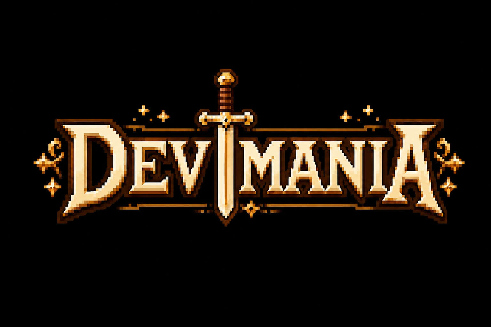

<h1>Um mundo feito por devs e para devs</h1>

Devmania é uma plataforma de aprendizado de programação gamificada com temática medieval. O desenvolvedor evolui suas habilidades resolvendo missões, competindo em duelos e treinando lógica de programação de forma engajada e divertida, tudo acompanhado por um mestre de IA personalizado.

---

### Seções

**Masmorra**
Home principal com moedas e progresso. Contém três pilares:
- Quests Diárias em três níveis (fácil → médio → difícil) com console de código, terminal Git e quadro de inputs/outputs esperados
- O Desafio semanal, onde o objetivo é encontrar e corrigir bugs em um projeto pronto
- Após resolver, o mestre dá feedback e recomendações

**Arena**
Duelos contra outros devs, no modo casual ou rankeado. O rei apresenta problemas e cada jogador resolve no menor tempo possível. O vencedor recebe um baú com moedas e insígnias. Há ligas nos modos Feat, Fix e Style.

**Academia**
Seção de treino livre. O usuário escolhe assuntos e trilhas, pratica linguagens e frameworks (até o git e o bash) e acompanha seu desempenho em um dashboard analisado pelo mestre.

**Guilda**
Comunidade com chat público por tópicos, guildas privadas e conversa direta com amigos com eventos e torneios.

**Oficina**
Perfil do jogador com customização da aparência do site, troca de mestre, lista de amigos, conquistas e insígnias adquiridas por baús.
